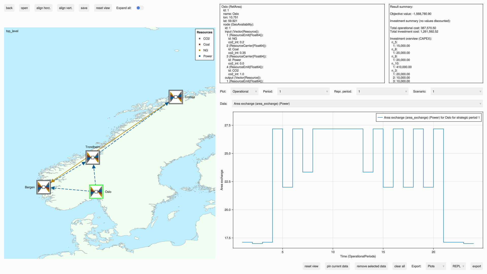

# EnergyModelsGUI

[](https://github.com/EnergyModelsX/EnergyModelsGUI.jl/actions?query=workflow%3ACI)
[](https://energymodelsx.github.io/EnergyModelsGUI.jl/stable/)
[](https://energymodelsx.github.io/EnergyModelsGUI.jl/dev/)
[](https://github.com/JuliaTesting/Aqua.jl)
[](https://github.com/JuliaDiff/BlueStyle)

EnergyModelsGUI enables a graphical user interface for the [EnergyModelsBase](https://github.com/EnergyModelsX/EnergyModelsBase.jl) package and other packages building upon this package (like [EnergyModelsInvestments](https://github.com/EnergyModelsX/EnergyModelsInvestments.jl) and [EnergyModelsGeography](https://github.com/EnergyModelsX/EnergyModelsGeography.jl)). It is designed to give a simple visualization of the topology of the model and enable the user to interactively navigate through the different layers of the model design. Visualization of the results after simulations will be added at a later stage.

The EnergyModelsGUI package has taken inspiration from the source code of [ModelingToolkitDesigner](https://github.com/bradcarman/ModelingToolkitDesigner.jl) as a starting point for development.

## Usage

If you already have constructed a `case` in EMX you can view this case with

```julia
using EnergyModelsGUI

GUI(case)
```

Please refer to the [documentation](https://clean_export.pages.sintef.no/energymodelsgui.jl/) for more details.

See examples of usage of the package and a simple guide for running them in the folder [`examples`](examples).

I.e. running the example [`EMI_geography`](examples/EMI_geography.jl) will result in a view like the following:



Opening the Oslo area will display that sub system:


## Project Funding

EnergyModelsGUI was funded by [FLEX4FACT](https://flex4fact.eu/). FLEX4FACT is receiving funding from the European Union’s Horizon Europe research and innovation programme under grant agreement [101058657](https://doi.org/10.3030/101058657).
