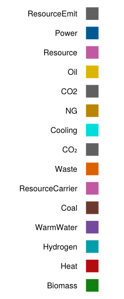

# [Customize colors](@id how_to-cust_colors)

EnergyModelsGUI provides a set of colors for a set of frequently used `Resource`-`id`s.
These can be found in `src/colors.yml` and are visualized below



If you have a `Resource` with another `id` or you want to alter the default colors, you need to specify the `id_to_color_map` option in the `GUI` function.

Say that your `case[:products]` contains the following products

```julia
NG     = ResourceEmit("NG", 0.2)
Coal   = ResourceCarrier("Coal", 0.35)
Power  = ResourceCarrier("Power", 0.)
new_id = ResourceEmit("NewID",1.)
```

and you want to alter the color of `Coal` and provide a custom color for the new `ResourceEmit` with `id` `NewID`, then simply do the following (colors can be a string in hex format or a symbol representing a named color from the [Colors.jl](https://juliagraphics.github.io/Colors.jl/stable/) package):

```julia
id_to_color_map = Dict(new_id.id => :yellow, NG.id => "#FF9876")
gui = GUI(case; id_to_color_map=id_to_color_map);
```
