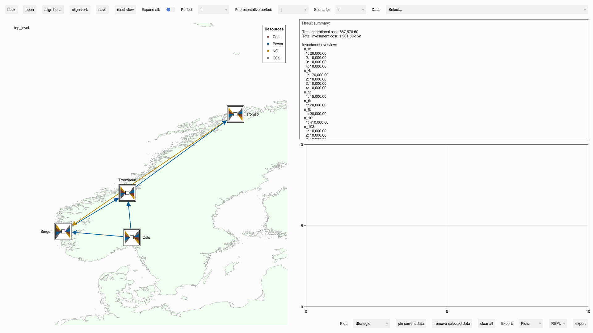

# Examples

For the content of the individual examples, see the [examples](https://github.com/EnergyModelsX/EnergyModelsGUI.jl/tree/main/examples) directory in the project repository.

## Installing the package

Enter Julia package mode (press `]`) and run:
```pkg
add EnergyModelsGUI
```

It might take a few minutes to install.

Then press `BACKSPACE` to exit package mode.

## Running the GUI

From the Julia REPL (*i.e*, command-line in julia; `julia> `), run

```julia
# Starts the Julia REPL
using Pkg
using EnergyModelsGUI

# Get the path of the examples directory
exdir = joinpath(pkgdir(EnergyModelsGUI), "examples")

# Activate project for the examples in the EnergyModelsGUI repository
Pkg.activate(exdir)
Pkg.instantiate()

# Include the code into the Julia REPL to run the following example
include(joinpath(exdir, "EMI_geography.jl"))
```

You should then get the following GUI:


To the left is a visualization of the topology. This window provides the following functionality:

1. You can move a `Node`/`Area` by holding down the left mouse button and dragging to the desired location (at which you then release the left mouse button). The `Links`/`Transmissions` to this `Node`/`Area` will be updated as well.
2. Selecting a `Node`/`Area`/`Link`/`Transmission` (by left-clicking) will print information about this object in the box on the top right. The selected object will have a green line style.
3. You can select multiple nodes/areas by holding down `ctrl` and left-clicking.
4. You can change the focus area (pan) of the window by holding down the right mouse button and dragging.
5. You can zoom in and out by using the scroll wheel on the mouse.
6. Hovering over a component will show its type.

The toolbar on top provides the following functionality:

1. `back`:  If currently in an area (opened by the `open` button, see below), navigate back to the `Top level` . This button has the keyboard shortcut `MouseButton4` (or `Esc`). Note: This functionality only works when using the `EnergyModelsGeography` package, as in this example.
2. `open`: Open an area by first selecting the area to open and then clicking this button. This button has the keyboard shortcut `space`. Opening an area can also be accomplished by double clicking the area icon. Note: This functionality only works when using the `EnergyModelsGeography` package, as in this example.
3. `align horz.`: Align selected nodes/areas horizontally.
4. `align vert.`: Align selected nodes/areas vertically.
5. `save`: Save the coordinates of the `Node`s/`Area`s to file (if there are multiple areas, a file for each area in addition to a file for the `Top level`). The location of these files can be assigned through the `design_path` input parameter to the `GUI` function.
6. `reset view`: Reset the view to the optimal view based on the current system if the view has been altered.
7. `Exapnd all`: Toggle this to show/hide all components of all `Area`s.
8. `Period`: Menu for choosing a `StrategicPeriod` for a case.
9. `Representative period`: Menu for choosing a `RepresentativePeriod` for a case.
10. `Scenario`: Menu for choosing a `Scenario` for a case. 
11. `Data`: Select the available data to be visualized in the plot area to the bottom right (if a component is selected, the menu will update to contain the available data for this component).

An additional toolbar on the bottom right is related to the plot area above and has the following functionality:

1. `Plot`: Activate one of the three available plots:
    - `Strategic`: Strategic period plot
    - `Representative`: Representative period plot
    - `Operational`: Operational period plot
2. `pin current data`: Pin the latest plotted data, which enables comparing with other data in the same time type.
3. `remove selected data`: After selecting a plot (left-click the line so it turns green), this button will remove it.
4. `clear all`: Removes all plots.
5. Export: Choose which data to export.
    - `All`: all data (or entire window)
    - `Plots`: the current active plots
6. Choose the export format (`REPL` prints the data to the REPL).
7. `export`: Export the data using the chosen setup.
